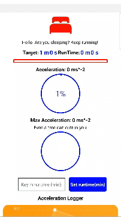

# RunLah

This feature was developed to complement the Walk Lah exercise app. It uses the Device Motion SDK to keep track of movement to help the user stay motivated in achieving his or her target. The movement is logged via react chart kits. The user can set the target run time.



If the user stops movement, all progress will be reset within a grace period of 4 seconds.

The working elements are contained within DeviceMotionScreen.js. It has 3 main components which must be imported into the screen.

The HomeScreen and SettingsScreen is included and can be further expanded as a standalone app in the future.

## Dependencies
```
npx expo install expo-sensors
```
```
npm install react-native-chart-kit 
```
```
npm install --save react-native-svg-charts
```
```
npm install react-native-progress --save
```

package.json file
```
"@react-navigation/bottom-tabs": "^6.5.11",
"@react-navigation/native": "^6.1.9",
"@types/react": "~18.2.45",
"expo": "^50.0.0",
"expo-sensors": "~12.9.1",
"expo-status-bar": "~1.11.1",
"react": "18.2.0",
"react-native": "0.73.2",
"react-native-chart-kit": "^6.12.0",
"react-native-progress": "^5.0.1",
"react-native-svg": "^14.1.0"
```
## References for dependencies
Device Motion SDK
https://docs.expo.dev/versions/latest/sdk/devicemotion/

Progress Bar, Circle and Pie
https://github.com/oblador/react-native-progress

Line Graph
https://github.com/indiespirit/react-native-chart-kit

## Fixed Persistent Bug - Please alert me if you see this!

During startup the device motion sensor may be undefined. I have included null checks to counteract this. In my useEffect i also do not directly monitor data.acceleration.x in the dependency array, instead I monitor data.accelearation as a whole.

```
ERROR TypeError: Cannot read property 'x' of undefined

This error is located at:
in DeviceMotionScreen (at SceneView.tsx:132)
in StaticContainer
in EnsureSingleNavigator (at SceneView.tsx:124)
in SceneView (at useDescriptors.tsx:218)
in RCTView (at View.js:116)
in View (at Screen.tsx:63)
in RCTView (at View.js:116)
in View (at Background.tsx:13)
in Background (at Screen.tsx:58)
in Screen (at BottomTabView.tsx:135)
in RNSScreen (at createAnimatedComponent.js:54)
in Unknown (at src/index.native.tsx:314)
in Suspender (at src/index.tsx:40)
in Suspense (at src/index.tsx:39)
in Freeze (at src/index.native.tsx:206)
in DelayedFreeze (at src/index.native.tsx:313)
in InnerScreen (at src/index.native.tsx:566)
in Screen (at ScreenFallback.tsx:39)
in MaybeScreen (at BottomTabView.tsx:127)
in RNSScreenContainer (at src/index.native.tsx:398)
in ScreenContainer (at ScreenFallback.tsx:30)
in MaybeScreenContainer (at BottomTabView.tsx:93)
in RNCSafeAreaProvider (at SafeAreaContext.tsx:92)
in SafeAreaProvider (at SafeAreaProviderCompat.tsx:46)
in SafeAreaProviderCompat (at BottomTabView.tsx:92)
in BottomTabView (at createBottomTabNavigator.tsx:118)
in PreventRemoveProvider (at useNavigationBuilder.tsx:718)
in NavigationContent (at useComponent.tsx:35)
in Unknown (at createBottomTabNavigator.tsx:117)
in BottomTabNavigator (at App.js:18)
in EnsureSingleNavigator (at BaseNavigationContainer.tsx:430)
in BaseNavigationContainer (at NavigationContainer.tsx:132)
in ThemeProvider (at NavigationContainer.tsx:131)
in NavigationContainerInner (at App.js:17)
in App (at withDevTools.js:18)
in withDevTools(App) (at renderApplication.js:57)
in RCTView (at View.js:116)
in View (at AppContainer.js:127)
in RCTView (at View.js:116)
in View (at AppContainer.js:155)
in AppContainer (at renderApplication.js:50)
in main(RootComponent) (at renderApplication.js:67), js engine: hermes
ERROR TypeError: Cannot read property 'x' of undefined
```